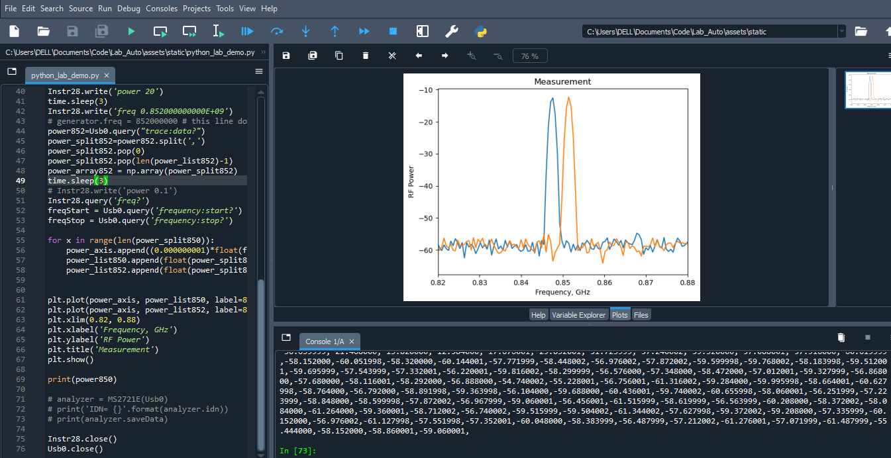
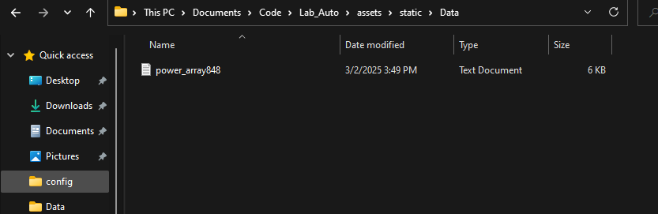

# Lab_Automation
This repo shows few examples of running test equipment over python. 
## Current stable version
Among files in static folder, select python_lab_demo in Spyder IDE. Connect RF spectrum analyzer and RF generator, click run. Script will plot two graphs. It will display equipment IDNs and first dataset in terminal.  It will save first set of data in the /static/Data folder. 
## Future version 
Future development is in python_equipment_manual_original.py file. I have idea what I plan to do and how to do that. But I would prefer to attend OFC python automation short course before that. 

data file is empty in the beginning. I start script type a command in terminal, then I refresh browser. Note that I am on a localhost, not on my laptop. A set of data appears on the screen. As I hit save button, set of data is recorded to a file. And it gets displayed in a terminal. As I change game ID and repeat procedure, different set of data is recorded to a file then gets displayed in a terminal. 